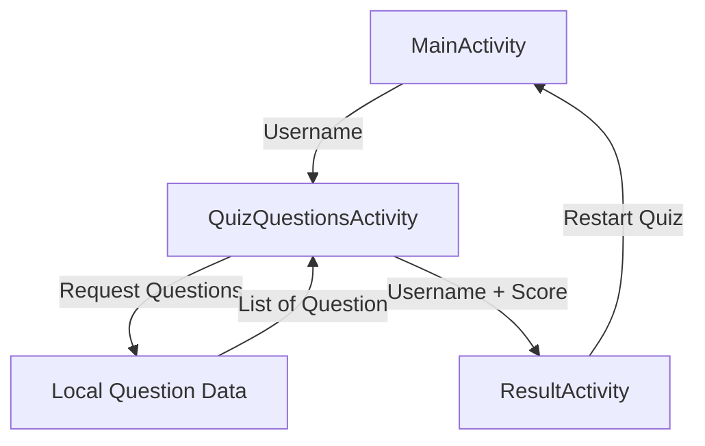
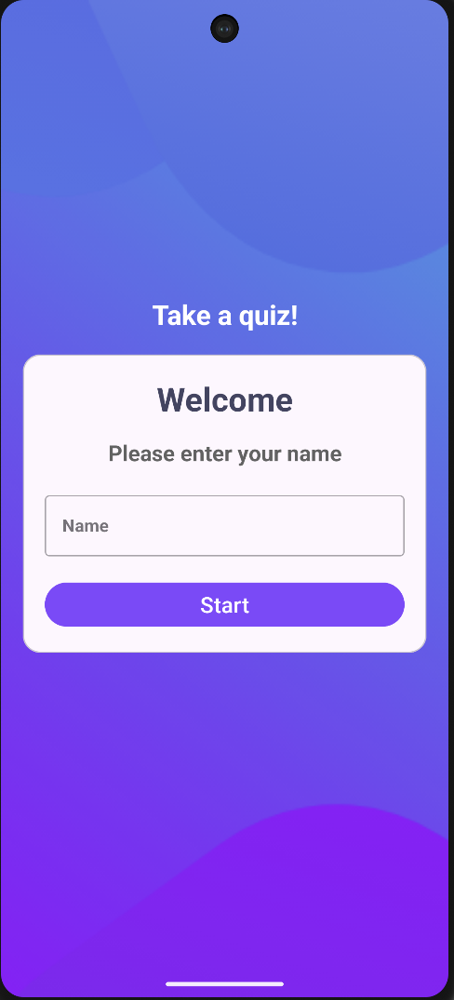
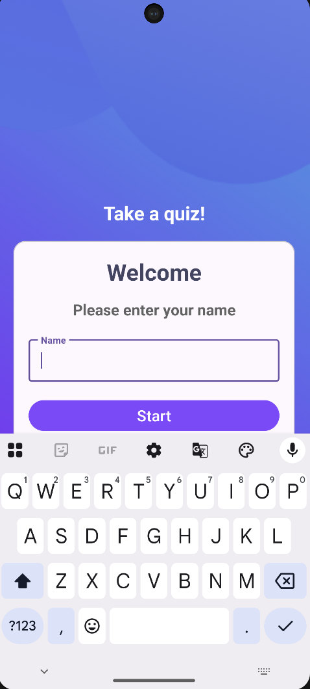
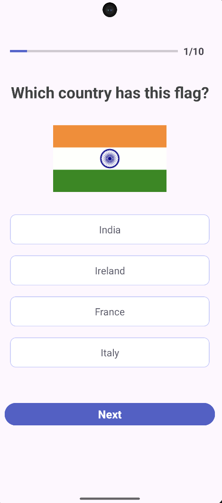
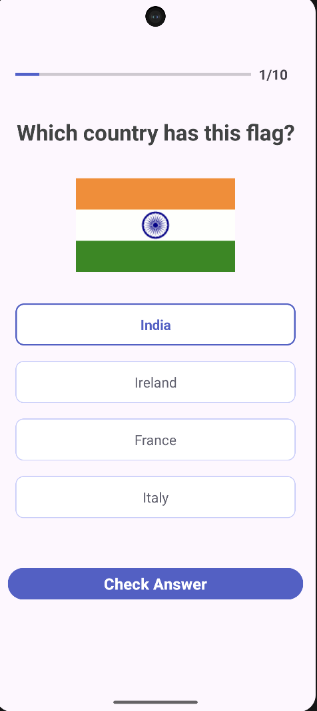
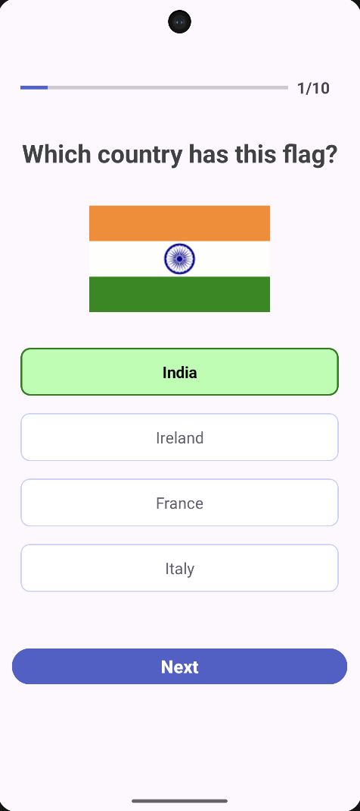
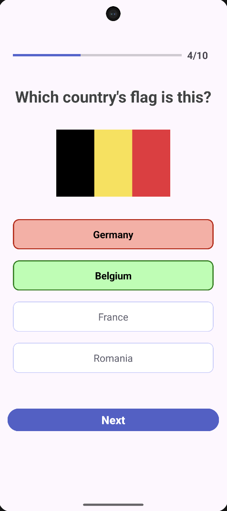
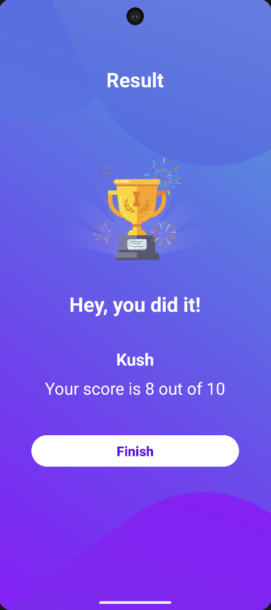

# Quiz App

A simple Android quiz application that tests users' knowledge of country flags. Users enter their name, identify countries from their flags using multiple-choice options, receive visual feedback, and view their final score.

This project was built as a practical Android learning project to strengthen Kotlin, Android Activities, XML layouts, UI state management, event handling, and navigation between screens.

---

## 📱 App Overview

**Flag Quiz App** is a multiple-choice geography quiz focused on identifying countries by their national flags.

The user enters their name, answers a series of flag-based questions, receives immediate feedback after submitting each answer, and gets a final score at the end of the quiz.

### 🎯 Problem It Solves

The application provides a simple and interactive way to test and improve knowledge of country flags while demonstrating fundamental Android application development concepts.

### 👥 Target Users

- Students learning world geography
- Users interested in country flags
- Casual quiz and trivia enthusiasts
- Anyone looking for a simple educational quiz

---

## ✨ Features

- 👤 Enter player name before starting
- 🌎 Identify countries from their flags
- 🔘 Four multiple-choice options per question
- 🎨 Highlight the selected option
- ✅ Highlight the correct answer
- ❌ Highlight an incorrectly selected answer
- 🔒 Disable options after an answer is checked
- 📊 Display quiz progress
- 🧮 Automatically calculate the score
- 🏆 Display the final score
- 👋 Display the player's name on the result screen
- 🔄 Restart the quiz
- 📱 XML-based Android UI
- 💾 Works entirely with locally stored quiz data
- 🌐 No internet connection required

---

## 🛠 Tech Stack

### Language

- **Kotlin**

### Android

- Android SDK
- Android Activities
- XML Layouts
- Android Views
- `Intent`
- `TextView`
- `EditText`
- `Button`
- `ImageView`
- `ProgressBar`
- `Toast`

### UI & Styling

- XML layouts
- Android Drawable resources
- `ContextCompat`
- `Typeface`
- Programmatic UI state changes

### Architecture

The application uses a **simple Activity-based architecture**.

The quiz state is managed inside `QuizQuestionsActivity`, while quiz data is represented using a Kotlin `data class` and provided through a local data source.

> **Note:** MVVM and Clean Architecture are not required for this small application. The current structure keeps the project simple and focused on Android fundamentals.

---

## 🏗 Architecture

The application follows a lightweight architecture suitable for a small offline quiz application.

### High-Level Structure

```text
┌─────────────────────┐
│    MainActivity     │
│                     │
│  Enter Player Name  │
└──────────┬──────────┘
           │
           │ Intent
           │ Username
           ▼
┌────────────────────────────┐
│   QuizQuestionsActivity    │
│                            │
│  • Display questions       │
│  • Handle user selection   │
│  • Check answers           │
│  • Track score             │
│  • Manage quiz state       │
└──────────┬─────────────────┘
           │
           │ List<Question>
           ▼
┌─────────────────────┐
│      Constants      │
│                     │
│  Local Quiz Data    │
└─────────────────────┘
           │
           │ Result data
           ▼
┌─────────────────────┐
│   ResultActivity    │
│                     │
│  Display Score      │
│  Display Username   │
└─────────────────────┘

```

---

## Data Flow



---

## 🧩 Main Components

### `MainActivity`

Responsible for:

- Accepting the player's name
- Validating the input
- Starting the quiz
- Passing the username to `QuizQuestionsActivity`

---

### `QuizQuestionsActivity`

Responsible for:

- Displaying the current question
- Displaying answer options
- Tracking the current question
- Tracking the selected option
- Checking answers
- Updating answer appearance
- Tracking correct answers
- Disabling options after checking
- Navigating to the result screen

---

### `ResultActivity`

Responsible for:

- Displaying the player's name
- Displaying the final score
- Returning the user to the main screen

---

### `Question`

Represents a single quiz question.

```kotlin
data class Question(
    val id: Int,
    val question: String,
    val image: Int,
    val optionOne: String,
    val optionTwo: String,
    val optionThree: String,
    val optionFour: String,
    val correctAnswer: Int
)
```

---

### `Constants`

Contains:

- Intent keys
- Local quiz questions

Example:

```kotlin
const val USERNAME = "user_name"
const val TOTAL_QUESTIONS = "total_questions"
const val CORRECT_ANSWERS = "correct_answers"
```

---

## 📁 Project Structure

A realistic project structure for the current application:

```
QuizApp/
│
├── app/
│   │
│   └── src/
│       │
│       └── main/
│           │
│           ├── java/
│           │   └── kush/
│           │       └── android/
│           │           └── quizapp/
│           │               │
│           │               ├── MainActivity.kt
│           │               ├── QuizQuestionsActivity.kt
│           │               ├── ResultActivity.kt
│           │               ├── Question.kt
│           │               └── Constants.kt
│           │
│           └── res/
│               │
│               ├── drawable/
│               │   ├── default_border_bg.xml
│               │   ├── selected_border_bg.xml
│               │   ├── correct_border_bg.xml
│               │   ├── incorrect_border_bg.xml
│               │   └── flag images
│               │
│               ├── layout/
│               │   ├── activity_main.xml
│               │   ├── activity_quiz_questions.xml
│               │   └── activity_result.xml
│               │
│               ├── mipmap/
│               │
│               └── values/
│                   ├── colors.xml
│                   ├── strings.xml
│                   └── themes.xml
│
├── screenshots/
│   ├── main-screen.png
│   ├── quiz-screen.png
│   ├── answer-feedback.png
│   └── result-screen.png
│
├── build.gradle.kts
├── settings.gradle.kts
├── README.md
└── .gitignore
```

---

## 🔁 Complete Application Flow

```
┌──────────────────────┐
│   Launch Application │
└──────────┬───────────┘
           ↓
┌──────────────────────┐
│    MainActivity      │
│                      │
│    Enter Name        │
└──────────┬───────────┘
           ↓
      Name Empty?
       /        \
     Yes         No
      ↓           ↓
 Show Toast   Start Quiz
                  ↓
       ┌──────────────────────┐
       │ QuizQuestionsActivity│
       └──────────┬───────────┘
                  ↓
            Load Question
                  ↓
          ┌───────────────┐
          │ Select Option │
          └───────┬───────┘
                  ↓
        Button = Check Answer
                  ↓
          ┌───────────────┐
          │ Check Answer  │
          └───────┬───────┘
                  ↓
        Correct or Incorrect
                  ↓
          Show Answer Feedback
                  ↓
            Disable Options
                  ↓
             Is Last Question?
              /            \
            No              Yes
             ↓                ↓
        Button = Next    Button = Submit
             ↓                ↓
      Next Question      ResultActivity
             │                ↓
             │          Display Results
             │                ↓
             │          Tap "Finish"
             │                ↓
             └────────→ MainActivity
```

---

## 📸 Screenshots

| | | | |
|---|---|---|---|
| <div align="center"><strong>First Screen</strong></div> | <div align="center"><strong>Enter Name</strong></div> | <div align="center"><strong>Question Screen</strong></div> | <div align="center"><strong>Check Answer</strong></div> |
|  |  |  |  |
| <div align="center"><strong>Correct Answer</strong></div> | <div align="center"><strong>Incorrect Answer</strong></div> | <div align="center"><strong>Result Screen</strong></div> | |
|  |  |  | |

---

## 🎯 Use Cases

The application can be used for:

- 🌎 Learning country flags
- 🧠 Testing geography knowledge
- 🎓 Educational practice
- 🏫 Classroom activities
- 👨‍👩‍👧‍👦 Casual family quizzes
- 🎮 Casual trivia and entertainment
- 📱 Practicing Android development fundamentals
  

The same application concept could later support other quiz categories such as:

- Capital cities
- World geography
- History
- Science
- Programming
- General knowledge
- Mathematics

---

## 🚧 Future Improvements

### 🧠 Quiz Features

- Randomize question order
- Randomize answer options
- Add multiple quiz categories
- Add difficulty levels
- Add timed questions
- Add different quiz modes
- Add question review
- Add score history
- Add leaderboards

### 💾 Local Persistence

- Add Room Database
- Store previous quiz results
- Store high scores
- Maintain quiz history
- Save user preferences

### 🌐 Backend

- Fetch questions from a remote API
- Firebase integration
- Online leaderboards
- User authentication
- Cloud synchronization
- Remote question management

### 🎨 UI/UX

- Add animations and transitions
- Add dark mode
- Improve accessibility
- Improve responsive layouts
- Add score animations
- Add sound effects
- Add optional background music

---

## 📚 Learning Outcomes

This project provided practical experience with:

- Kotlin fundamentals
- Kotlin `data class`
- Kotlin collections and `List`
- Android Activities
- XML layouts
- `findViewById`
- `OnClickListener`
- `Intent`
- Passing data between Activities
- `putExtra()` and `get...Extra()`
- UI state management
- Conditional UI updates
- Progress tracking
- Dynamic View styling
- Drawable resources
- Enabling and disabling Views
- Basic score calculation
- Activity lifecycle fundamentals

---

## 💼 Portfolio & Freelancing

This project is part of my **personal Android development portfolio** and demonstrates practical experience building Android applications using Kotlin and the Android SDK.

I am also **open to freelancing opportunities** and interested in working on:

- Android applications
- Mobile products
- Custom Android solutions
- MVP development
- Feature implementation
- Application maintenance and improvements

If you're interested in collaborating or hiring me for an Android development project, feel free to get in touch.

---

## 📄 License

This project is primarily intended for educational and portfolio purposes.
